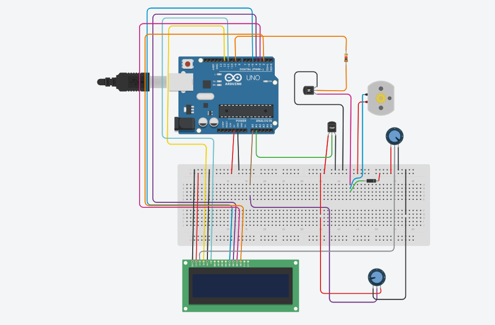

# Smart Room Temperature and Humidity Sensor
This project is mainly focused on solving the problem of energy wastage through provision of smart sensors to control
room temperature and humidity 
In many homes,offices,schools among other places temperature and humidity are not properly monitored 

PROJECT RECORDING HERE [https://drive.google.com/drive/folders/1nncgvmq1IEuUwiC-70Yc3WELEbAebx_6?usp=drive_link]

The simulation of the project can be found here on Tinkercard [https://www.tinkercad.com/things/a5jEcTCLdLK-room-temperature-smart-sensor-by-joshua/editel?returnTo=https%3A%2F%2Fwww.tinkercad.com%2Fdashboard%2Fdesigns%2Fcircuits]

